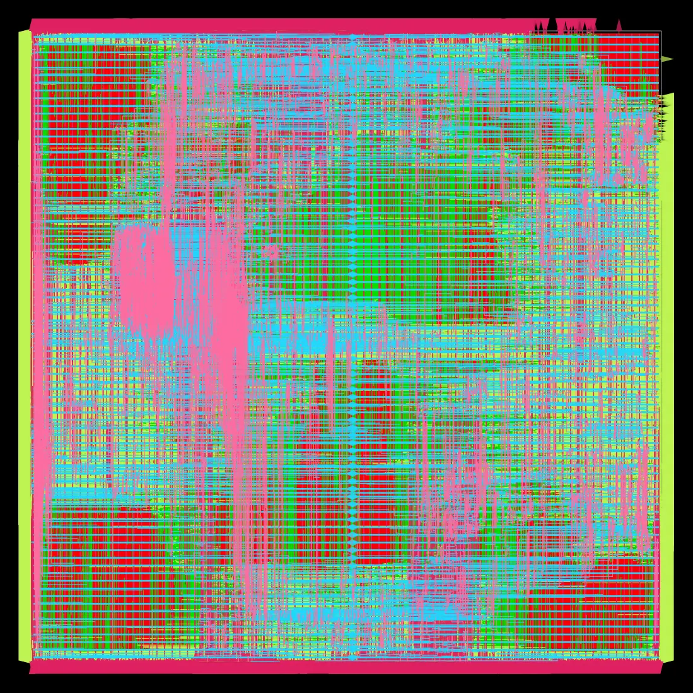
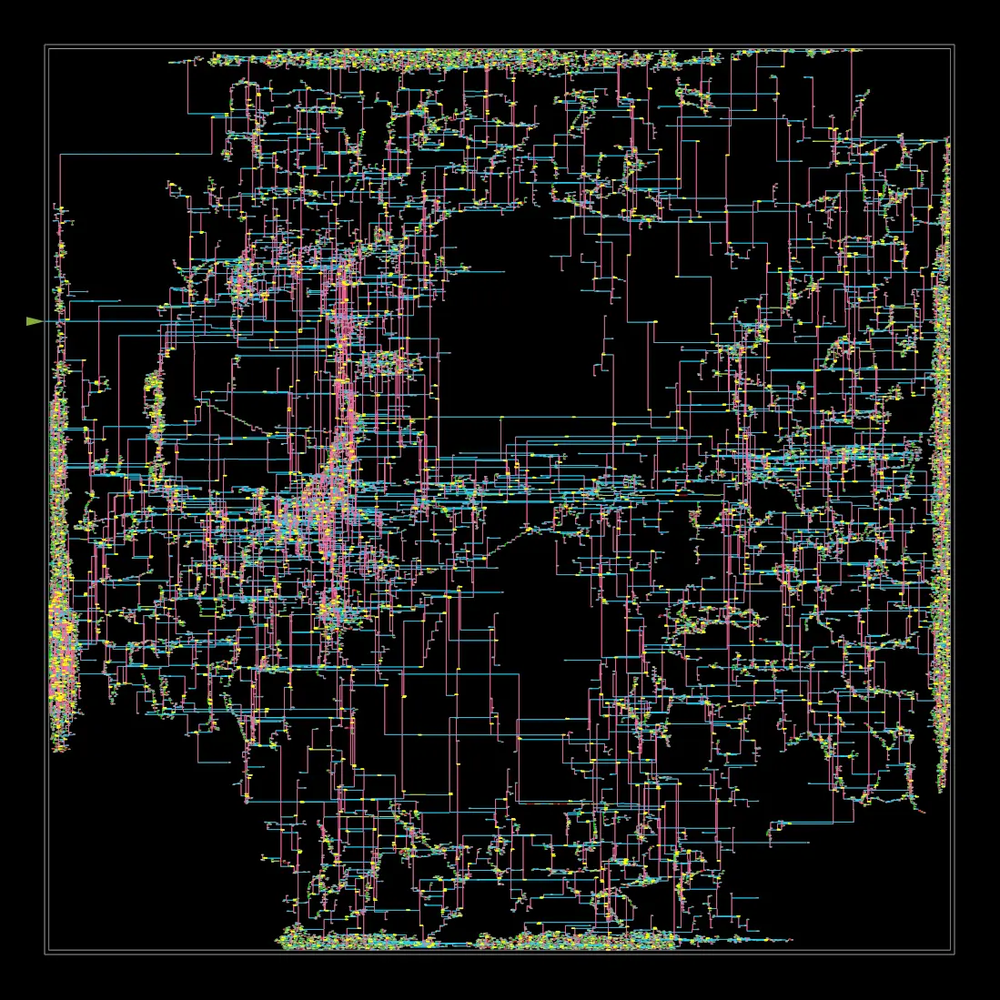
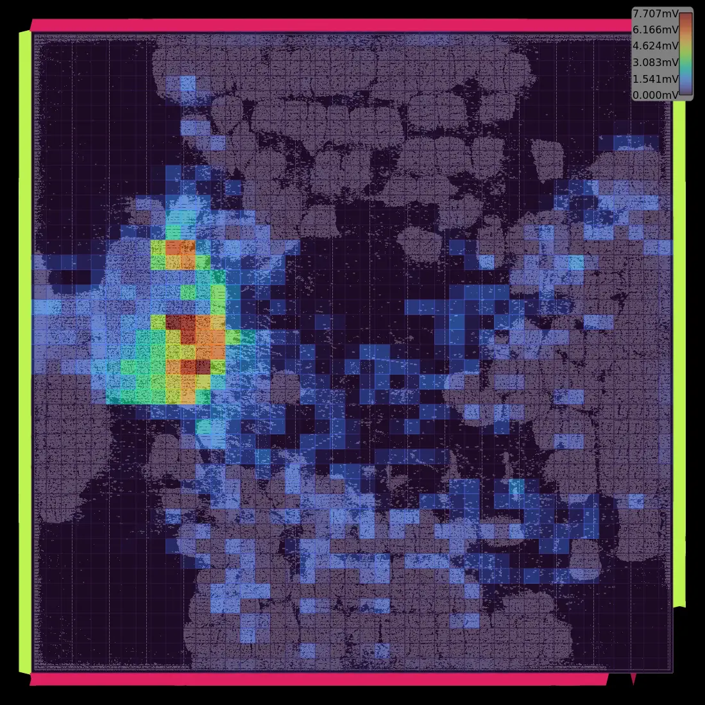
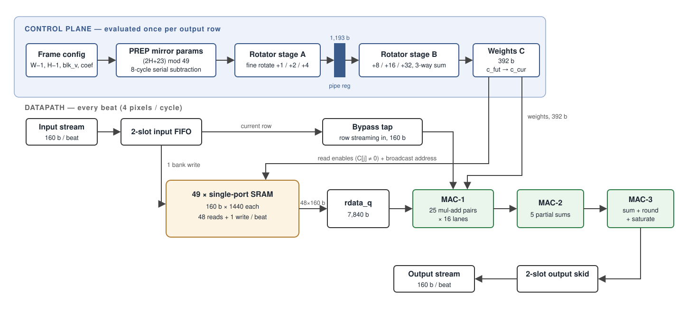
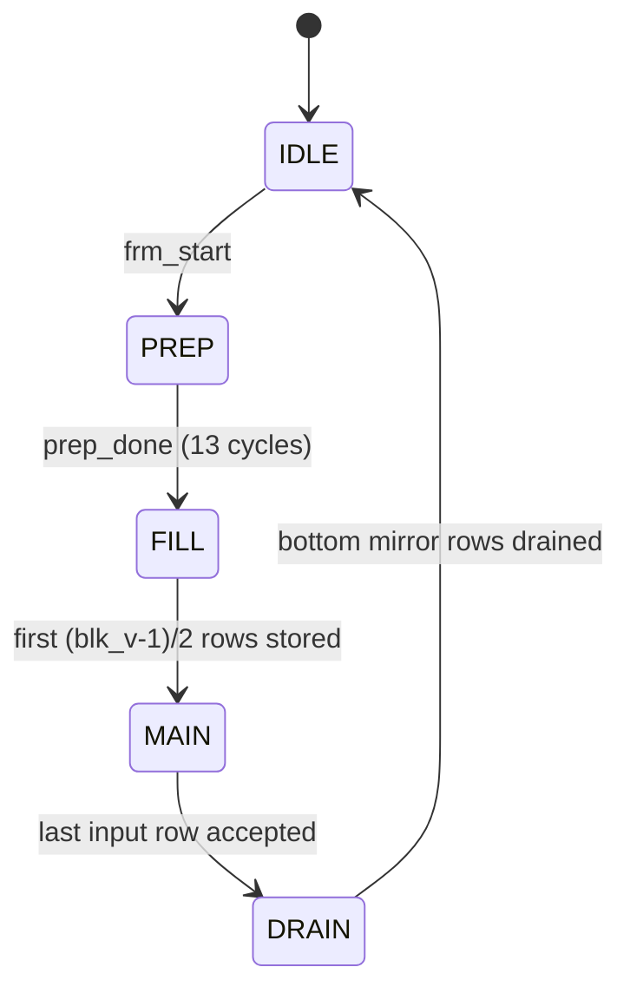

# vfir-7nm-rtl2gds

A 49-tap streaming vertical FIR video-filter ASIC block, taken from Verilog
RTL through **five complete open-source RTL-to-GDSII implementations**
(OpenROAD + Yosys) on the ASAP7 7 nm predictive PDK — ending in **1 GHz
timing closure at the fast corner** with every number backed by raw reports,
SHA-256 manifests, independently re-run verification audits and CI.

| Final result (v4, post-route SPEF) | |
| --- | --- |
| 1 GHz @ FF/BC, documented 100 ps setup uncertainty | **setup +34.3 ps / hold +4.9 ps, both TNS 0** |
| Same netlist, legacy conservative 150 ps view | 984.5 MHz (−15.7 ps; both views published) |
| True slow corner (SS 0.63 V/100 °C) | **520 MHz** measured limit; ≤ 500 MHz recommended operating point |
| Power / area / instances | **45.6 mW · 0.047 mm² · 468 k** |
| Hold, max-cap, max-fanout, geometric routing DRC | **0 violations** (DRC clean in all five implementations) |
| Journey | 830 → 952 → 1000 MHz · 3.28 W → 45.6 mW |

<p align="center">
  
  
  
</p>

## The design

`IMG_FILTER` filters an RGBA video stream (10 bit/component, 4 pixels/clock)
with a configurable vertical FIR kernel:

- **Kernel**: 1×`blk_v`, `blk_v` = 1…49 (odd), symmetric 8-bit coefficients
  summing to 128; mirror boundary handling at the top/bottom image edges.
- **Throughput**: 4 pixels/cycle sustained for every legal kernel size.
- **Streaming**: elastic ready/valid handshake on both ports, arbitrary
  backpressure and starvation tolerated.
- **Line storage**: 49 external single-port SRAM banks (160 bit × 1440),
  scheduled so that 48 reads and 1 write land in the same cycle.

### The architectural trick: rotate coefficients, not data

A naive implementation muxes 49 SRAM banks onto 49 filter taps and evaluates
the mirror mapping per tap, per beat — a 7840-bit barrel rotation plus
per-beat index arithmetic that closes neither timing nor area.

This design inverts the problem. Image row `m` lives in bank `m mod 49` at an
address equal to the beat index, so **pixel data never moves and all banks
share one broadcast address**. For each output row a 392-bit *effective weight
vector* `C[j] = Σ{coef_k | mirror(y+k, H) mod 49 == j}` is built from three
rotations of the symmetric coefficient array (interior / top-folded /
bottom-folded taps). Mirror logic vanishes from the datapath entirely; what
remains is a uniform 50-tap × 16-lane MAC array (the 50th tap forwards the row
currently streaming in, freeing its bank for that cycle's write). Bank read
enables derive from `C`, so external-memory traffic scales with `blk_v`, not
with the bank count — a `blk_v = 1` frame performs zero SRAM accesses.


<p align="center"></p>

### Micro-architecture notes that came from measurement, not intuition

- **MAC pipelining**: two balanced MAC stages measured ~35 logic levels each
  (1.18 ns at the SS corner), so the array is cut three ways — 25 multiply-add
  pairs, 5 partial sums, and a final round/saturate stage — buying +105 MHz of
  signoff fmax for +7 % area and one cycle of latency.
- **Elastic interfaces**: both stream ports terminate in two-slot register
  FIFOs so the pipeline enable is a function of registers only. The first
  physical-design iteration proved why: a combinational
  `ready → pipe_en → 7840 register enables` path was the walk-away timing
  wall of the whole design (repair gained 6 ps per 1000 iterations on it).
- **Pipelined weight rotator (v4)**: the mod-49 rotate is a 6-level log
  shifter; splitting it at its midpoint (`rot49_lo`/`rot49_hi`, 1,193
  pipeline bits, one PREP count shifted) halves the cone depth, kills the
  `mod_x` rotation-amount bottleneck structurally, and removes the need
  for any multicycle constraint — bit-identical over the full regression.
- **Clock gating**: register-enable muxes are inferred into ICG cells
  (34 in the v4 signoff netlist; 30–34 across spins), removing 7840 feedback muxes and cutting idle clock power —
  and creating the gated-subtree skew problem whose diagnosis and
  quantified trade-off (3.5× power vs. hold-repairability) became the
  [hold-closure study](docs/hold-study.md).
- **SRAM interface constraints**: the `mem_*` pins are constrained as
  same-clock synchronous pins with the common tree insertion modeled
  explicitly — three progressively subtler SDC bugs (generic IO budget,
  cross-clock constraint coexistence, ideal-launch vs propagated-capture
  skew) each fabricated thousands of unfixable violations before being
  diagnosed from the repair logs.

### Legal configuration (the integration contract)

- `img_width` carries **W − 1** (11 bit) and `img_height` carries **H − 1**
  (12 bit) — so the architectural ceiling is 2048 × 4096; both dimensions
  must be ≥ 24 (the spec guarantees at most one mirror fold).
- `blk_v` is odd, 1…49; coefficients are symmetric about the centre tap and
  sum to 128 (normalization is `+64 >> 7`).
- `frm_start` arrives at least one cycle before the first beat; the module
  then spends 13 PREP cycles with `in_pix_need` low. A frame is exactly
  `H × ⌈W/4⌉` input beats; trailing-lane contents are ignored.
- `rst_n` asserts asynchronously and must be **released through an external
  synchronizer** (declared SDC false-path contract).
- The external SRAMs are single-port, 160 bit × 1440, and hold the last
  read data while `ce` is low.

### Control flow



PREP-phase alignment of the v4 two-stage weight pipeline (why
`prep_cload` sits at count 11):

| PREP count | Event |
| --- | --- |
| 0 | `a_sym` coefficient table loaded from `coef_q` |
| 1–8 | `(2H+23) mod 49` — one conditional subtraction per cycle |
| 9 | rotator **stage A** latches (all sources final since count 8) |
| 10 | `c_fut` latches the first effective weight vector |
| 11 | `prep_cload`: `c_cur` captures it; look-ahead steps to row 1 |
| 12 | `prep_done` → FILL/MAIN |

## Verification

- **Golden model** (`verification/reference_model.py`): an executable
  specification plus an *architectural cross-validation* — the weight-vector
  formulation is checked identical to the per-tap mirrored expansion across
  117 (shape × kernel) combinations (a finite test space, not a proof over
  all legal inputs), along with the storage invariants (a read
  bank always holds a written row; read and write banks never collide).
- **Self-checking testbench** (`verification/img_filter_tb.v`): behavioural
  single-port SRAM model with X-initialized contents, randomized
  ready/valid pressure on both ports, X injection on unused lanes, latency
  and dead-cycle checks. **54 frames, 2,821,840 component comparisons, 0
  errors** on the current RTL.

```sh
python3 verification/reference_model.py     # ALL REFERENCE CHECKS PASSED
iverilog -g2005 -o tb.vvp rtl/img_filter_def.v rtl/img_filter.v \
         verification/img_filter_tb.v && vvp tb.vvp   # +SMOKE for 13-frame CI subset
```

Beyond the regression, the repo carries **runnable verification harnesses**,
all independently re-run (2026-09-01) with Icarus 14 / Verilator 5 /
Yosys-SBY-EQY 0.68 / Boolector:

- [`formal/`](formal/) — 40-cycle control-safety + split-rotator BMC
  (SBY; properties bound into the RTL under `` `ifdef FORMAL_PROPERTIES ``)
- [`equiv/`](equiv/) — EQY RTL-vs-generic-synthesis equivalence setup
- [`verification/`](verification/) — targeted testbenches: 0–48 rotation
  coverage (`rotator_tb.v`), PREP boundary/transition alignment
  (399,650 checks), runtime reset injection, zero-delay GLS smoke, and a
  CDC/RDC structural analyzer

**Verification scorecard** (current v4 status — full detail and evidence in
[`docs/verification-status.md`](docs/verification-status.md), raw audit
files in [`docs/audit/`](docs/audit/)):

| Check | Status |
| --- | --- |
| RTL dynamic (54-frame regression, seeds, rotation/PREP/reset targeted TBs) | **PASS** |
| Formal functional completeness | **PARTIAL** — bounded control-safety + pipeline BMC; no unbounded end-to-end proof |
| CDC | **PASS** (single clock domain, no internal crossings) |
| RDC | **CONDITIONAL** — 21,371 datapath bits deliberately unreset; reset-injection + bounded-formal evidence; external reset-synchronizer contract |
| Synthesis equivalence | **PARTIAL / INCONCLUSIVE** — 532/680 EQY partitions proven, 147 unknown, 1 resource error (`rdata_q`), 0 counterexamples |
| Zero-delay GLS (generic netlist) | **PASS** — mapped-netlist/SDF GLS not yet run |
| 1 GHz FF/BC operating view | **PASS** (documented 100 ps uncertainty; legacy 150 ps view −15.7 ps, both published) |
| MMMC / electrical / physical signoff | **NOT CLOSED** — 243 max-slew, single RC extraction, no LVS/EM |

## Physical implementation (OpenROAD-flow-scripts + ASAP7)

Flow configuration in [`flow/asap7/`](flow/asap7/): 1 GHz SDC (three
constraint views kept side by side — `constraint_reported.sdc` with the
historical blanket 150 ps uncertainty, `constraint_recommended.sdc` with the
corrected `-setup 150 / -hold 30` split, and the frozen-IO `sweep_*.sdc`
set), **`asap7sc7p5t` 7.5-track RVT cells** with NLDM Liberty views
(FF 0.77 V/25 °C · TT · SS 0.63 V/100 °C; exact files pinned in
`reports/liberty_manifest.sha256`), the platform's single RCX extraction
model, 22 % core utilization. **Timing corner**: the flow signs off at the
ORFS ASAP7 default `CORNER=BC` (FF libraries) — see the corner note below
the results.

### Five implementations, one honest trajectory

| Leg | What changed | What it established |
| --- | --- | --- | --- |
| `base` (v3 RTL) | baseline, blanket SDC | 952 MHz BC fmax; hold/slew debt under phantom-taxed constraints |
| `wc` | true slow corner | honest 1 GHz gap: WNS −950.6 ps → 513 MHz measured limit |
| `sel` | `clockgate -min_net_size 2000` (ICGs 30 → 2) | controlled gating ablation: 44.2 ↔ 155.1 mW (3.5×) vs. hold-repairability |
| `mcp` | multicycle exception + corrected hold uncertainty | first fully hold-clean post-route signoff (2,426 phantom hold endpoints → **0**) |
| **`v4`** | pipelined rotator RTL, clean split-uncertainty SDC, repair margins | **1 GHz closure at BC** · 520 MHz WC · 45.6 mW · 0.047 mm² |

```sh
# inside an OpenROAD-flow-scripts checkout
cp rtl/* $ORFS/flow/designs/src/img_filter/
cp flow/asap7/* $ORFS/flow/designs/asap7/img_filter/
cd $ORFS/flow && make DESIGN_CONFIG=./designs/asap7/img_filter/config.mk
```

### Measured results — v4 signoff (the current design)

All v4 numbers from the `6_finish` signoff report (post-route parasitics,
BC corner = ORFS ASAP7 default) and the standalone audits pinned by
`manifest_v4.sha256`:

| Metric | v4 |
| --- | --- |
| **1 GHz @ FF/BC, documented 100 ps setup / 30 ps hold uncertainty** | **setup +34.3 ps, hold +4.9 ps — both TNS 0** |
| Legacy conservative 150 ps setup-uncertainty view | −15.7 ps → 984.5 MHz (both views published) |
| True slow corner (SS 0.63 V/100 °C, frozen-IO @ 2000 ps) | +76.9 ps → **520 MHz** limit; ≤ 500 MHz recommended |
| Typical corner (TT, diagnostic) | ≈ 750 MHz |
| Hold / max-cap / max-fanout / geometric routing DRC | **0 / 0 / 0 / 0** |
| Electrical residual (disclosed) | 243 max-slew endpoints |
| Congestion overflow | 0 on all layers (M3 peak 26.2 %) |
| Area | 43,063 µm² synth · **47,297 µm² post-route, 468 k instances** |
| Power (vectorless, 1 GHz) / worst IR drop | **45.6 mW** / 5.8 mV (0.75 %) |

### The optimization journey (v2 → v3 → v4)

| Metric | v2 (2-stage MAC) | v3 (3-stage MAC) | **v4 (pipelined rotator, final)** |
| --- | --- | --- | --- |
| Signoff fmax | 847 MHz | 952 MHz (setup WNS −50.35 ps / TNS −2.05 ns over 140 endpoints vs. 1 GHz) | **1 GHz closed** (documented 100 ps view: setup +34.3 ps, TNS 0; legacy 150 ps view: −15.7 ps → 984.5 MHz) |
| Hold WS (pre-hold-fix, blanket-uncertainty SDC¹) | −25 ps residual | −37.8 ps / TNS −8.68 ns over 1601 endpoints | **+4.9 ps / TNS 0 / 0 endpoints** (corrected −hold 30 SDC, in-flow repair) |
| Electrical DRVs at signoff | — | 881 max-slew, 1 max-cap, 0 max-fanout endpoints | 243 max-slew (disclosed), **0 max-cap, 0 max-fanout** |
| Routing DRC (geometric²) | 0 | 0 | **0** |
| Routing congestion overflow | 0 | 0 on all 7 metal layers | **0** on all layers (M3 peak 26.2 %) |
| Synthesis area | 39,842 µm² | 42,697 µm² (+7 % for the extra pipe registers) | 43,063 µm² |
| Post-route std-cell area | 47,410 µm² | 50,471 µm², 513 k instances | **47,297 µm², 468 k instances** (smallest spin) |
| Power (vectorless, 1 GHz) | 75 mW | 72 mW | **45.6 mW** (lowest spin) |
| Worst IR drop | 7.8 mV | 7.5 mV | 5.8 mV (0.75 %) |
| True slow-corner setup (SS 0.63 V/100 °C, standalone STA) | — | −998 ps → ≈ 500 MHz | +76.9 ps @ 2000 ps frozen-IO → **520 MHz** |
| Hold at the fast corner (proper hold corner) | — | −38 ps residual | **clean** (+4.9 ps / TNS 0) |
| WC implementation @ 1 GHz SDC | — | setup WNS −950.6 ps over 10,694 endpoints → feasible ≈ 513 MHz | not re-implemented at WC; limit measured by sweep (520 MHz) |
| **1 GHz timing status** | — | not closed (historical) | **CLOSED at BC** (documented uncertainty view; both views published) |

¹ All historical reports were produced with a blanket
`set_clock_uncertainty 150` that also taxes every hold check with the full
setup margin — later root-caused as the 8th constraint artifact (see the
[hold-closure study](docs/hold-study.md)). That SDC is preserved verbatim as
[`flow/asap7/constraint_reported.sdc`](flow/asap7/constraint_reported.sdc);
the corrected split-uncertainty version is
[`constraint_recommended.sdc`](flow/asap7/constraint_recommended.sdc).
² "DRC 0" means geometric routing DRC (TritonRoute spacing/via/antenna —
[`reports/drc_summary.txt`](reports/drc_summary.txt)), not the electrical
and timing checks, which are disclosed in the rows above.

Repository reports directly back the **v3 and hold-study** results
([`reports/README.md`](reports/README.md) maps every file to its run); the
v1/v2 values in this table are historical cross-spin observations retained
for the narrative.

**Corner honesty note.** An external constraint review prompted a standalone
OpenSTA audit of the shipped netlist + SPEF ([`reports/`](reports/)), which
surfaced that ORFS's ASAP7 platform defaults to `CORNER=BC` — every in-flow
signoff above is therefore at the *fast* corner, where this document
originally claimed SS. The true SS picture was then measured directly:
≈ 500 MHz setup-limited (a typical fast/slow ratio for RVT at 0.63 V), with
hold checked at the fast corner as it should be (−38 ps WNS, −8.7 ns hold
TNS — an earlier revision of this note mislabeled the setup TNS as hold).
The SPEF comes from a single RC extraction, so the standalone numbers are a
close approximation rather than a multi-corner extraction signoff.

**Audit addenda (plan-v3 round).** (1) The BC final-netlist worst setup
endpoints are the `c_fut[*]` weight-vector look-ahead registers — the 392-bit
triple-rotation cone — not the MAC array; since that vector is consumed once
per output row, it is a clean multicycle-path candidate (future work). 
(2) `check_timing` (any flag combination) does not terminate on this
500k-instance netlist in standalone OpenSTA, and `report_checks
-unconstrained` re-prints constrained groups in this version — so the
unconstrained-endpoint count is **tool-limited, unverified**; the assertion
harness marks those checks UNKNOWN rather than PASS.
STA scripts, reports and SHA-256 manifests live in [`reports/`](reports/).

### The slow-corner implementation and the hold-closure study

A second full RTL-to-GDS run at the true slow corner turned the 1 GHz gap
and the hold-repair problem into a controlled, fully evidenced study —
summarized here, with the complete investigation in
[**docs/hold-study.md**](docs/hold-study.md):

- **WC @ 1000 ps violation report**: setup WNS −950.6 ps; a frozen-IO
  period sweep pins the feasible period at 1950.6 ps ≈ **513 MHz**,
  matching signoff to 0.01 ps; the `c_fut` weight-rotator cone is the sole
  limiter at every point.
- **Two hold-repair experiments**: full gating (30 ICGs) plateaus at
  −114.7 ps on ~200 ps of gated-subtree clock skew; selective gating
  (`clockgate -min_net_size 2000`, ICGs 30 → 2) removes the
  rejection-spinning and cuts hold TNS 94 %.
- **The 8th SDC artifact class**: a blanket `set_clock_uncertainty 150`
  taxes every hold check with the full setup margin. Under the corrected
  `-setup 150 / -hold 30` split the repaired netlist is analytically
  adjusted to **+15.5 ps — hold closed** — and the 120 ps linear shift is
  empirically validated to 0.01 ps.
- **Controlled ICG ablation** (only the gating threshold differs):
  44.2 mW ↔ 155.1 mW — a quantified 3.5× power-vs-hold-closure trade.
- **The closed loop (mcp leg)**: a fourth implementation with the
  corrected hold uncertainty and the evidence-backed multicycle exception
  completed repair → detailed route → RCX extraction → final STA in one
  flow: **hold WNS +26.6 ps / TNS 0 / 0 endpoints at the fast corner —
  the first fully hold-clean post-route signoff** (clean at TT too;
  routed SPEF; `reports/mcp_6_finish.rpt` + three-corner matrix in
  `reports/matrix_mcp_*.rpt`). Its setup residual (−51 ps on the `mod_x`
  rotation-amount cone) was then retired structurally by the v4
  pipelined rotator — see the next bullet.
- **The v4 finish line**: the pipelined-rotator RTL ran as a fifth, fully
  clean-provenance implementation (recommended SDC from synthesis, no
  multicycle constraints, positive repair margins). Signoff: **hold 0 /
  cap 0 / DRC 0, 45.6 mW, 47,297 µm²** — fastest, smallest and coolest
  spin of the project. Setup at 1 GHz: −15.69 ps under the original
  arbitrary-conservative 150 ps uncertainty (**984.5 MHz**); under a
  documented revision to a still-generous 100 ps, **1 GHz closes: setup
  +34.31 / hold +4.88, both TNS 0** (`reports/v4_ff_u100.rpt`; both
  figures published side by side). Slow-corner limit improves to
  **520 MHz**, TT to ≈ 750 MHz. Full story:
  [docs/hold-study.md](docs/hold-study.md).
- **Current accurate statement**: at the fast corner the design closes
  1 GHz under the documented 100 ps setup uncertainty (984.5 MHz under
  the legacy 150 ps default); at SS 0.63 V/100 °C the measured setup
  limit is ≈ 520 MHz and the recommended operating point with guardband
  is **≤ 500 MHz**. Hold, max-cap, max-fanout and geometric DRC are clean
  through the full route-and-extract loop; 243 max-slew endpoints remain
  disclosed. Not done: per-corner RC extraction (single RCX model),
  LVS/EM, and a tool-complete unconstrained-endpoint audit
  (`check_timing` is tool-limited; the enumeration evidence — 23,399
  register data pins on the single clock + explicit port-list
  constraints — stands in).
- Scope: academic flow — geometric routing DRC 0 on all four
  implementations, no LVS/EM, SRAMs as interface timing models only.
  Reproduction drivers: [`flow/experiments/`](flow/experiments/);
  provenance: [`reports/README.md`](reports/README.md).


### The bottleneck hunt, in one paragraph

The first implementation closed at 830 MHz with 3.3 W of vectorless power and
every critical endpoint on the 7840-bit SRAM read-data register bank.
Stage-by-stage WNS/TNS analysis separated the overlapping causes: a genuine
architectural wall (the backpressure enable fanning out to 7840 data muxes —
fixed in RTL with elastic skid buffers and inferred ICG clock gates), and
several layers of constraint fiction (generic IO budgets on same-clock SRAM
pins, ideal-launch vs. propagated-capture skew, silently failing SDC
collection arithmetic — each diagnosed from repair-log behavior and fixed
with explicit, insertion-tracking pin constraints).  The clean rerun closed at 847 MHz / 75 mW with the MAC compressor tree as
the one honest limiter, and a third MAC pipeline stage then took signoff to
**952 MHz / 72 mW** (BC corner). The presumed "RVT MAC floor" turned out to
be the weight-rotator cone instead: a multicycle exception moved the wall to
the rotation-amount (`mod_x`) fanout, and the structural fix — pipelining
the rotator itself — retired both at once. The v4 spin closes **1 GHz at
the fast corner** (with the corrected, documented uncertainty split), lifts
the true-slow-corner limit to **520 MHz** (now genuinely MAC-limited, SLVT
the next lever), and is simultaneously the smallest and lowest-power
implementation of the series at **45.6 mW / 0.047 mm²**. Layout gallery in
[`docs/img/`](docs/img/).


## Repository layout

```
rtl/               synthesizable Verilog (top: IMG_FILTER; formal
                   properties bind under `ifdef FORMAL_PROPERTIES)
verification/      golden model, 54-frame self-checking TB (CI-fatal on
                   fail, +SMOKE subset), rotation/PREP/reset targeted TBs,
                   GLS smoke, CDC-RDC analyzer
formal/            SBY bounded-model-check harness + property file
equiv/             EQY equivalence setup (RTL vs generic synthesis)
flow/asap7/        design config + SDC views (reported / recommended /
                   mcp / sweep set)
flow/experiments/  reproduction drivers for the hold-closure study
reports/           raw evidence + provenance map (reports/README.md),
                   three SHA-256 manifests (v4 checked by CI)
docs/              hold-study.md, verification-status.md, audit archives
                   (docs/audit/), routed-database renders
```

The [`reports/`](reports/) directory carries the unedited tool output backing
every number in the results table: `6_finish_sta.rpt` (post-route OpenSTA
signoff — WNS/TNS, fmax, clock skew, worst paths), `4_cts_sta.rpt` and
`5_groute_sta.rpt` (stage-by-stage timing trajectory), `5_route_drc.rpt`
(zero bytes — the DRC proof), `1_synth_area.txt`, and `6_metrics.json`
(machine-readable power/area/IR metrics).

## Acknowledgments

This project stands on open-source EDA infrastructure built by others:

- **[OpenROAD](https://github.com/The-OpenROAD-Project/OpenROAD)** and
  **[OpenROAD-flow-scripts](https://github.com/The-OpenROAD-Project/OpenROAD-flow-scripts)**
  (The OpenROAD Project) — the complete RTL-to-GDSII flow, placement, CTS,
  routing, and the OpenSTA timing engine used throughout. T. Ajayi et al.,
  *"Toward an Open-Source Digital Flow: First Learnings from the OpenROAD
  Project"*, DAC 2019.
- **[Yosys](https://github.com/YosysHQ/yosys)** (Claire Xenia Wolf and the
  YosysHQ team) — synthesis and the `clockgate` inference this project's
  gating experiments are built on.
- **[ASAP7](https://github.com/The-OpenROAD-Project/asap7)** (Arizona State
  University / L. T. Clark et al.) — the 7 nm predictive PDK. L. T. Clark
  et al., *"ASAP7: A 7-nm finFET predictive process design kit"*,
  Microelectronics Journal 53 (2016).
- **[Icarus Verilog](https://github.com/steveicarus/iverilog)** and
  **[Verilator](https://github.com/verilator/verilator)** — simulation and
  lint.

All results in this repository were produced with these tools at the exact
versions pinned in [`reports/TOOL_VERSIONS.txt`](reports/TOOL_VERSIONS.txt);
any errors in their use are this project's own.

## Toolchain

Icarus Verilog · Verilator (lint) · Yosys 0.68 · OpenROAD 26Q3 · OpenSTA ·
ASAP7 7 nm predictive PDK · WSL2 Ubuntu 22.04

## License

MIT — see [LICENSE](LICENSE). ASAP7 and OpenROAD-flow-scripts carry their own
licenses.
