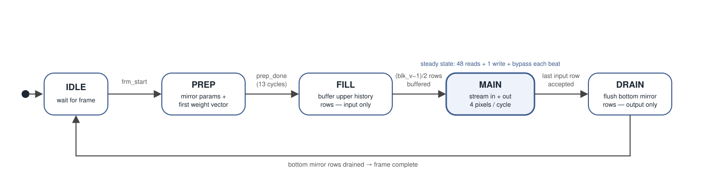

# vfir-7nm-rtl2gds

A configurable 49-tap streaming vertical FIR ASIC block: algorithm mapping,
Verilog RTL, verification, and OpenROAD/Yosys implementation on the **ASAP7
predictive 7 nm PDK**. The project records both working results and remaining
limitations. It is an academic RTL-to-GDS study, not a tapeout-ready chip.

**Start here:** [step-by-step RTL-to-GDS walkthrough / 中文实践手册](docs/rtl-to-gds-walkthrough.md)
· [timing assumptions](docs/constraint-assumptions.md)
· [verification status](docs/verification-status.md)
· [AI experiments](experiments/README.md)

| v4 evidence | Result and scope |
| --- | --- |
| FF/BC, 1 GHz, assumed setup/hold uncertainty 100/30 ps | Setup WNS **+34.31 ps**, hold **+4.88 ps**; both TNS 0, same routed candidate |
| FF/BC, 1 GHz, implementation uncertainty 150/30 ps | Setup WNS **−15.69 ps**, TNS −117.37 ps, 19 endpoints; hold +4.88 ps |
| SS, 2 ns, historical sweep with blanket 150/150 ps | Setup **+76.89 ps**; hold **−303.10 ps**, hold TNS −1,570,621.12 ps; single-SPEF diagnostic |
| Area / power | **47,297.3 µm²** standard-cell area; **45.58 mW** vectorless estimate in the FF view; external SRAM excluded |
| Electrical / routing | **243 max-slew violations**; max-cap/fanout and geometric routing DRC 0 in the reported FF implementation |
| Full MMMC / physical signoff | **NOT CLOSED**: incomplete constraint coverage, single RC extraction, no foundry LVS/EM or SRAM-macro signoff |

Changing uncertainty changes the STA model, not the circuit. The 100/30 ps
budget is an assumption awaiting physical jitter/variation/interface sources.
The ~520 MHz SS figure is a **setup-limited estimate**, not a certified safe
operating frequency. SS hold cannot be dismissed just because FF often
dominates hold. [Original reports and corrected provenance](reports/README.md).

<p align="center">
  
  
  
</p>

The gallery illustrates the implementation journey; use report/run manifests,
not screenshots, to identify the candidate behind a numerical result.

## Design and architecture

- RGBA, 10-bit unsigned components, 4 pixels per 160-bit beat.
- Odd vertical kernel 1..49, nonnegative symmetric 8-bit coefficients,
  expanded sum 128; rounding `(sum+64)>>7` and 10-bit saturation.
- Mirror boundaries with repeated edge pixels; elastic stream handshake.
- Integration/test contract: W=24..1440, H=24..4096, encoded as W−1/H−1.
  Port width alone does not establish support for a wider untested image.
- 49 external 160-bit × 1440-word single-port SRAM interfaces; no physical
  SRAM macros in the reported GDS. At width 1440 only 360 words/bank are used.

**Rotate coefficients, not pixels.** Row `m` resides in bank `m mod 49`.
For each output row, effective weight `C[j]` sums coefficients whose mirrored
source rows map to bank j. The hardware rotates a 392-bit weight vector,
instead of dynamically rotating a 7,840-bit bank-data bus. The current row
bypasses SRAM, freeing its bank for a write while up to 48 others are read.
There are 49 bank product slots plus one bypass slot, not 50 independent rows.
Zero-weight bank reads are suppressed.

<p align="center"></p>

The implementation combines two-slot input/output buffers, registered SRAM
returns, a three-stage MAC (25 product pairs → 5 partial sums → round/saturate),
and a v4 split rotator (1/2/4 shifts → registers → 8/16/32 shifts). The
pipeline enable depends on registered flow-control state. v4 has no multicycle
exception for the rotator. Coefficient preparation takes 13 PREP cycles;
steady-state throughput is 4 pixels/cycle when both ends can transfer.
First-output latency also includes row filling and stalls.

<p align="center"></p>

See the [walkthrough](docs/rtl-to-gds-walkthrough.md) for legal configuration,
PREP cycle alignment, SRAM protocol, accumulator bounds and per-stage files.

## Verification and quick start

```bash
python3 verification/reference_model.py
iverilog -g2005 -o /tmp/vfir.vvp rtl/img_filter_def.v rtl/img_filter.v verification/img_filter_tb.v
vvp /tmp/vfir.vvp +SMOKE +SEED=12345678
verilator --lint-only -Irtl -Wno-UNSIGNED rtl/img_filter.v --top-module IMG_FILTER
```

| Check | Evidence boundary |
| --- | --- |
| Broad RTL regression | Historical v4 54 frames, 2,821,840 component checks, 0 errors; targeted rotation/PREP/reset and four smoke seeds also recorded |
| Python reference | 117 finite shape/kernel architecture cross-checks; not an unbounded proof |
| Native UVM | **17 frames / 6,440 beats PASS**, real SRAM model, observed-input convolution predictor, Python golden, K=1/3/5/7/49, width modulo-4 cases; both injected-fault controls detected; [run guide](verification/uvm/README.md) |
| Formal | 40-cycle control/rotator BMC; no unbounded end-to-end FIR proof |
| EQY | 532/680 partitions proven, 147 UNKNOWN, 1 resource ERROR, no proven counterexample; no final mapped-netlist LEC |
| CDC / RDC | One RTL clock; reset release relies on an external synchronizer; unreset payload isolation has bounded/dynamic evidence |
| GLS | Historical generic zero-delay smoke; publishing mapped inputs or exporting SDF does not establish mapped/SDF simulation PASS |

The ordinary CI covers model checks, smoke, targeted tests, lint and report
hashes. Weekly 54-frame simulation can exceed the runner budget; a cancelled
run is not PASS. Historical evidence and new UVM evidence are kept separate.

## Physical flow and reproducibility

ASAP7 uses the asap7sc7p5t 7.5T RVT standard-cell library, NLDM timing models
and OpenRCX extraction. The pinned ORFS default BC uses FF libraries at
0.77 V/25°C; WC uses SS at 0.63 V/100°C. Check exact Liberty headers for all
PVT values. [Tool versions](reports/TOOL_VERSIONS.txt).

```bash
export ORFS_ROOT=/path/to/OpenROAD-flow-scripts
export NUM_CORES=4
export FLOW_VARIANT=reproduce_v4_01
bash flow/run_stage.sh v4 synth
bash flow/run_stage.sh v4 cts
# Resume the same unchanged candidate later:
bash flow/run_stage.sh v4 finish
```

| Entry | Meaning |
| --- | --- |
| `config_historical.mk` | Explicit preserved blanket 150/150 model |
| `config_v4.mk` / default `config.mk` | v4 150/30 model, BC, fixed absolute IO budgets; fresh reproduction config |
| `audit_ff_u100.tcl` | Same final candidate, FF setup-uncertainty sensitivity view at 100/30 |

The historical v4 run used different slew margins before/after CTS. A fresh
consistent-margin reproduction is not guaranteed to be byte-identical.
Use the saved final candidate for exact standalone timing checks. The runner
rejects checkpoint reuse if fingerprinted source/config inputs change; do not
backdate files or clean away another experiment. Commands, stage wall time,
memory, checkpoint recovery and failure interpretation are in the
[walkthrough](docs/rtl-to-gds-walkthrough.md).

[Physical assets](docs/physical-assets.md) explain final netlist/SPEF/SDC/DEF,
derived SDF, upstream licenses and hashes. Checking a report manifest proves
integrity only. Independently rerunning STA/GLS requires all relevant inputs.

## Optimization journey

| Revision / experiment | Lesson |
| --- | --- |
| Early v1/v2 | Buffering and gated enables addressed a large backpressure fanout; historical ~830/847 MHz and power observations use different implementations |
| v3 | Three-stage MAC; reported BC setup WNS −50.35 ps at 1 ns, hold −37.77 ps under historical constraints |
| WC / selective gating | Exposed slow-corner setup failures and clock-gating/hold trade-offs; [hold study](docs/hold-study.md) retains failures and view distinctions |
| MCP | Historical exception/constraint experiment; mixed stage provenance, not the final v4 RTL solution |
| v4 | Explicit rotator pipeline; FF 150/30 setup −15.69 ps; same netlist FF 100/30 setup +34.31 ps |

These are not controlled causal power comparisons across all revisions.
Earlier v1/v2 values are historical observations; current v4 claims link to
raw reports. No reduction in uncertainty is counted as a transistor-level
architecture speedup.

## AI experiments

Three runnable extensions have their own evidence and limits:

1. **Learned FIR coefficients:** constrained learning and exact integer
   normalization; synthetic held-out denoising quality versus a fixed filter,
   plus original-RTL UVM validation of the learned weights.
2. **INT8 CNN operator:** parameterized signed 3×1 depthwise convolution with
   line buffers, bias, quantization, saturation and optional ReLU. Integer
   correctness is tested; this is not yet a complete trained CNN or routed IP.
3. **ML-assisted EDA search:** real small ORFS placement trials, online
   surrogate versus random selection, input-hash cache and explicit budgets.
   A pilot on gcd does not establish a FIR PPA improvement.

Measured first results: learned integer FIR **33.8568 dB PSNR** on held-out
synthetic denoising data (ties a near-uniform fixed filter); CNN signed-integer
and backpressure tests pass, but the first placement pilot has setup WNS
**−268.924 ps at 1 ns**; four-trial EDA search **ties random**. These are
explicit experimental baselines, not claims that adding AI automatically improves PPA.

[Experiment commands, methodology and results](experiments/README.md).

## Repository layout

```text
rtl/                 v4 FIR RTL, retained as the physical baseline
verification/        Python/Icarus targeted verification and native UVM
formal/ equiv/       bounded formal and partial synthesis equivalence
flow/                explicit timing views, stage runner and standalone STA
reports/             raw historical/new reports, provenance and manifests
docs/                walkthrough, assumptions, audits and figures
experiments/         learned FIR, INT8 CNN IP and EDA search pilots
tools/               physical asset export and bounded audit runners
```

## Upstream acknowledgments and license

Implementation infrastructure comes from [OpenROAD](https://github.com/The-OpenROAD-Project/OpenROAD),
[OpenROAD-flow-scripts](https://github.com/The-OpenROAD-Project/OpenROAD-flow-scripts),
[Yosys](https://github.com/YosysHQ/yosys), and [ASAP7](https://github.com/The-OpenROAD-Project/asap7).
Verification uses Icarus, Verilator, SBY/EQY, Boolector and the
[Verilator-compatible Accellera UVM library](https://github.com/verilator/uvm).
The coefficient mapping, RTL experiments, debugging, tests and evidence
organization are this project's work; upstream tools/models retain their
authorship and licenses. No upstream endorsement is implied.

Project code: [MIT](LICENSE). Upstream ASAP7 models carry their own BSD
notices, preserved with redistributed views. See [physical assets](docs/physical-assets.md).
